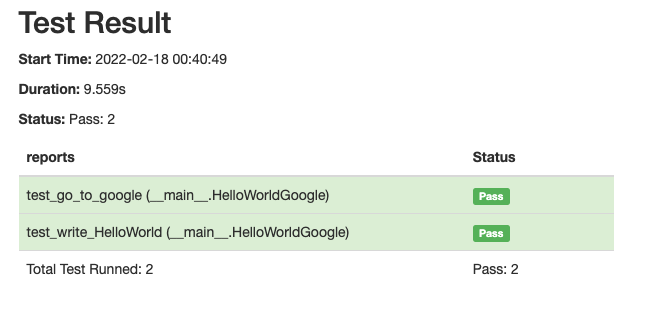
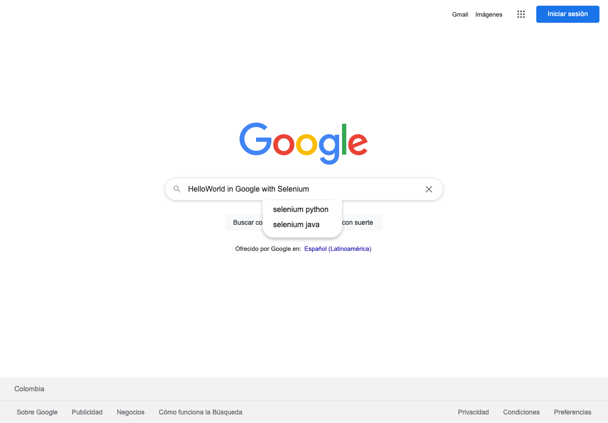

# Selenium Classic Hello World in Google

In this repository, you can find a simple exercise with  Selenium, in where I build a simple automatization over Firefox Browser. 

The flow is:
- Open a Firefox browser in the Google's URL.
- Write "Hello World in Google with Selenium"
- Take screenshot of the open session and saved this in img folder.
- Close the session and generate report in Folder reports.

For run this example, you need:

- Clone this repository. 
- In your local space, create a virtual envioronment.
- Activate the envioronment and install package so:
        
        pip3 install selenium webdriver-manager pyunitreport

Notes: 
- If you use a local browser different from Mozilla, you can make some modifications to hello_world.py script using [this documentation](https://pypi.org/project/webdriver-manager/) 

- In the methods that include logic, you should using test first and add the name that you want. Example:

        test_other_method ---> Correct form
        other_method ---> Incorrect form

- Remember that We used Python for this example and this is at least in version 3.6

- The class @classmethod permit that each method or test it could be execute in tyhe same firefox's window. If you want run each method for separete should be replace cls for self, delete @classmethod and change methods setUpClass and tearDownClass for setUp and tearDown respectively. 

Your report should look as:

and you screenshot as:

